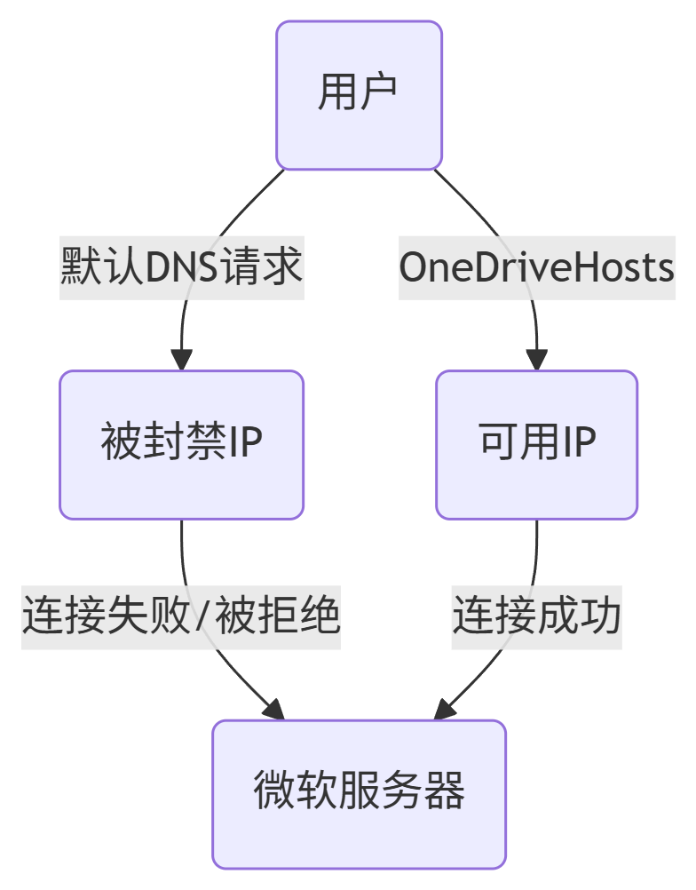

# OneDriveHosts

## 程序目的

通过指定OneDrive的网站的hosts，实现在封锁OneDrive的ip地址的区域使用OneDrive

## 程序来源


如上图所示，部分地区封锁了OneDrive的网站的ip，导致OneDrive无法正常使用，需要通过指定ip的方法使用OneDrive的其他ip

测试网址：<https://www.itdog.cn/ping/>

## 程序原理



## 程序成果


## 程序使用方法

> [!TIP]
> 在以下两种方案中任选其一即可

### 一、手动修改

修改hosts文件需要管理员权限，您可使用以下方案：

1. 按下`Windows徽标`+`X`
2. 选择`终端管理员`
3. 输入以下命令并回车：
4. 在hosts文件中添加内容：[前往查看hosts文件](https://onedrivehosts.blazesnow.com/)

```shell
notepad C:\Windows\System32\drivers\etc\hosts
```

### 二、SwitchHosts

> SwitchHosts 是一个管理、切换多个 hosts 方案的工具。它是一个免费开源软件。

- 官方地址：<https://switchhosts.vercel.app/zh>
- 下载链接：<https://github.com/oldj/SwitchHosts/releases>

> [!TIP]
> 免责声明：本文所介绍的 SwitchHosts 工具及其相关操作仅供学习与参考。作者并非 SwitchHosts 的开发者，与该软件的开发团队无任何关联。请在合法合规的前提下使用该工具，对 hosts 文件的修改操作需谨慎，并建议提前备份原始文件。因使用 SwitchHosts 所产生的任何问题或损失，均由用户自行承担，作者不承担任何责任。

#### 安装SwitchHosts

1. 打开下载链接：<https://github.com/oldj/SwitchHosts/releases>
2. 下载`SwitchHosts_windows_installer_x64_版本号.exe`
3. 运行并安装

#### 使用OneDriveHosts

1. 运行SwitchHosts
2. 添加配置并选择远程hosts文件
3. 在下列链接中选择一个填入
4. 打开配置的开关并观察hosts文件是否被添加内容

#### 远程hosts文件URL

① Cloudflare：

```ansi
https://onedrivehosts.blazesnow.com/
```

② GitHub：

```ansi
https://raw.githubusercontent.com/BlazeSnow/OneDriveHosts/main/hosts
```

③ Gitee：

```ansi
https://gitee.com/blazesnow/OneDriveHosts/raw/main/hosts
```

## 自定义IP地址

> [!CAUTION]
> 请勿随意自定义IP地址

若需要使用自定义的IP地址，可在hosts文件URL的后端加上`/?ip=13.107.42.12`

> 自定义IP地址功能仅适用于Cloudflare版本URL

```ansi
https://onedrivehosts.blazesnow.com/?ip=13.107.42.12
```
