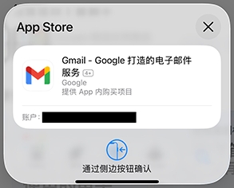

# IPAbuyer

## 软件介绍

- 刚刚拿到iPhone，受折磨于反复按下锁屏键购入App；
- 还是担心小众优质App被下架？
- 使用IPAbuyer，将App统统收入囊中！

## 获取途径

## 开发者信息

<https://github.com/ipabuyer/>

## AppStore购买流程

> 以Google的Gmail、Chrome和Gemini为例

1. 打开App Store
2. 登录Apple ID
3. 找到Gmail
4. 点击获取
5. 等待弹窗
6. 双击锁屏按钮
7. 找到Chrome
8. 点击获取
9. 等待弹窗
10. 双击锁屏按钮
11. 找到Gemini
12. 点击获取
13. 等待弹窗
14. 双击锁屏按钮

## IPAbuyer购买流程

> 以Google的Gmail、Chrome和Gemini为例

1. 打开IPAbuyer
2. 登录Apple ID
3. 搜索Google
4. 批量选择Gmail、Chrome和Gemini
5. 点击购买
6. 完成

## 常见问题

无法获取双重验证码？

> 对于登录在苹果设备，而不是仅使用手机号作为双重验证手段的账户，无法获取双重验证码是本软件的可预见的问题。请使用<https://account.apple.com/>获取双重验证码并填入本软件中。

账户、密码和双重验证码都正确，但无法登入？

> 受限于苹果的账户政策，要正常使用IPAbuyer，您的苹果账户需要登录过iCloud和AppStore，并在AppStore中进行过一次有效的购买。

为什么已购买的App在iPhone上仍然显示未购买？

> 这是因为iPhone未对已购买App列表进行刷新，在iPhone上对任意App进行一次购买即可刷新整个列表。

为什么iPhone上已购买的App在软件内显示未购买？

> 对于App是否购买，软件会以购买App的形式，向Apple服务器查询，这个过程受限于软件策略，只有用户手动点击购买后，才能获取软件的购买状态，所以软件内显示已购买的软件数量必然≤账户已购买的软件数量。

什么是“已购买”和“已拥有”？

> “已购买”是指通过本软件购买的App，“已拥有”是指未通过本软件购买的App。清空软件数据库会丢失“已购买”状态，在下一次查询后变为“已拥有”。

登录账户安全吗？

> 本软件将所有的登录信息保存于本地，不会对任何敏感信息进行上传，同时使用存储于软件数据库的随机密钥进行加密。

为什么不能进行付费购买？

> 为了保证账户安全性，本软件将进行App购买检查，只允许购买价格为0的App。

## 版权信息

Copyright © 2025 IPAbuyer. 保留所有权利。

以GNU Affero General Public License v3.0的条款发布。
