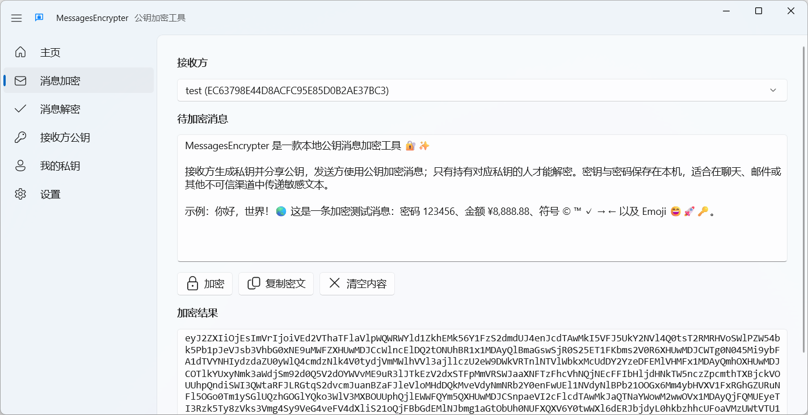

# <TitleIcon src="/icon/messagesencrypter.ico" /> MessagesEncrypter <FirstPartyBadge />

## 一、程序介绍

MessagesEncrypter 是一款面向 Windows 桌面端的本地公钥消息加密工具，用于在聊天、邮件或其他不可信渠道中传递敏感文本。接收方生成私钥并分享公钥，发送方使用该公钥加密消息；只有持有对应私钥的人才能解密密文包。

软件支持管理多个接收方公钥和多个个人私钥，适合同时维护不同联系人或身份的加密关系。每个私钥都可以独立设置密码，并可按需保存到 Windows 凭据管理器；密钥存档保存在应用本地数据目录，不依赖远程服务。

消息加密采用混合加密方案：使用 RSA-OAEP-SHA256 加密 AES-256-GCM 会话密钥，再使用 AES-GCM 加密消息正文。生成密钥时可选择 2048、3072、4096 或 8192 位 RSA，导入密钥支持 RSA-2048 及以上位数。

## 二、如何下载

即将上线 Microsoft Store。

## 三、软件截图

## 四、使用说明

## 五、开发者信息

- 项目仓库：<https://github.com/BlazeSnow/MessagesEncrypter>
- 项目官网：<https://www.blazesnow.com/messages/>
- 反馈邮箱：<messages@blazesnow.com>

## 六、版权信息

Copyright © 2026 BlazeSnow. 保留所有权利。

以GNU Affero General Public License v3.0的条款发布。

## 七、更新日志

更新日志见：<https://github.com/BlazeSnow/MessagesEncrypter/blob/main/CHANGELOG.md>
