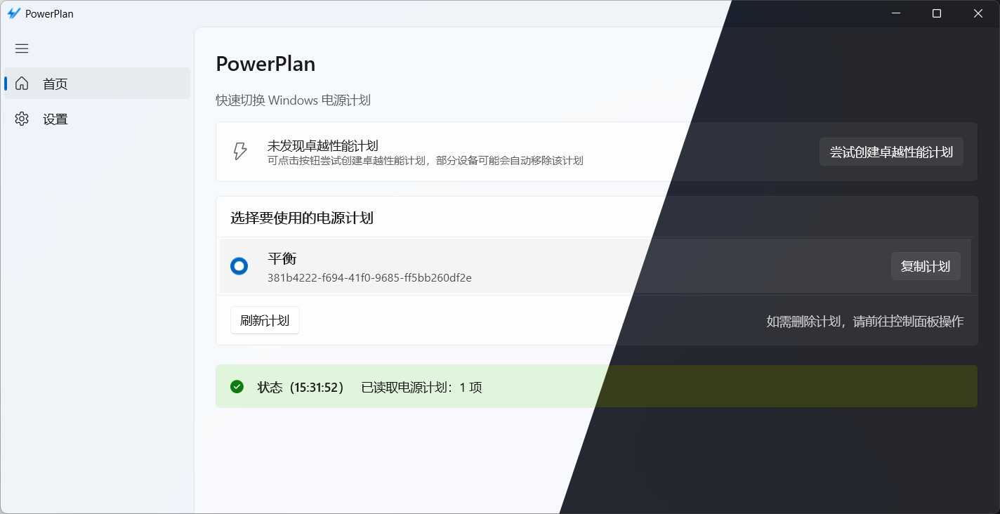
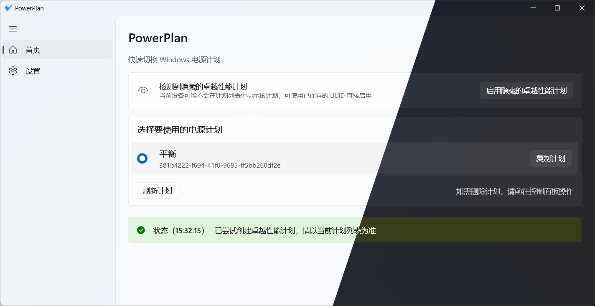
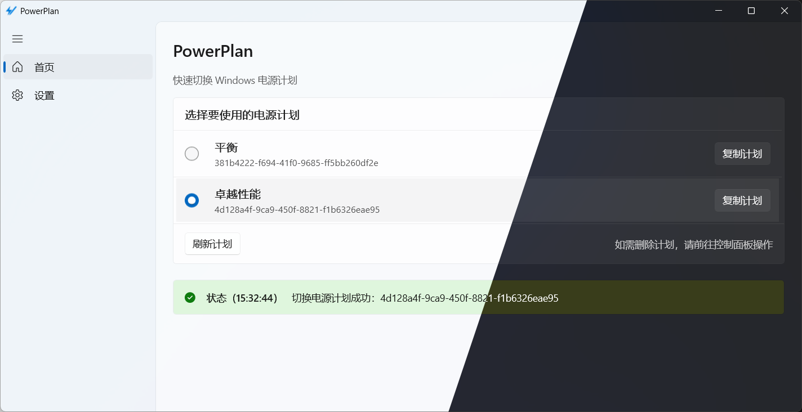
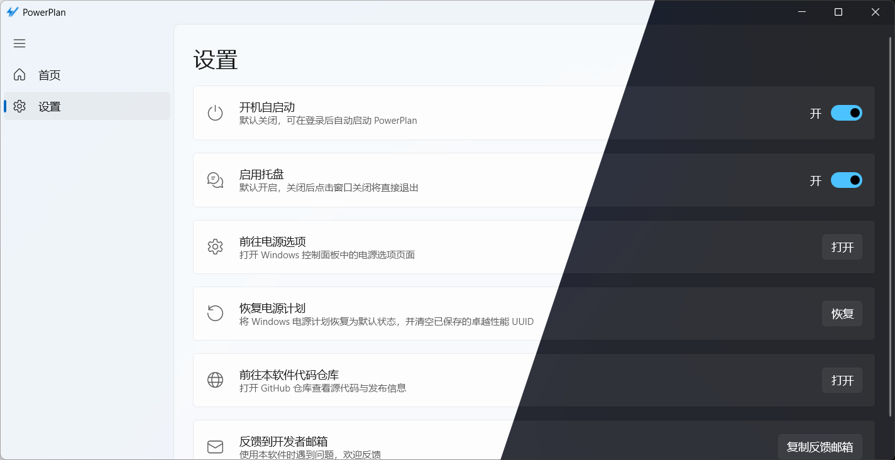

# PowerPlan

## 一、程序介绍

本程序针对Windows系统的电源计划，帮助用户快速切换电源计划。

## 二、如何下载

## 三、软件截图

## 四、开发者信息

<https://github.com/BlazeSnow>

## 五、版权信息

Copyright © 2026 BlazeSnow. 保留所有权利。

以GNU Affero General Public License v3.0的条款发布。

## 六、更新日志

更新日志见：<https://github.com/BlazeSnow/PowerPlan/blob/main/CHANGELOG.md>
