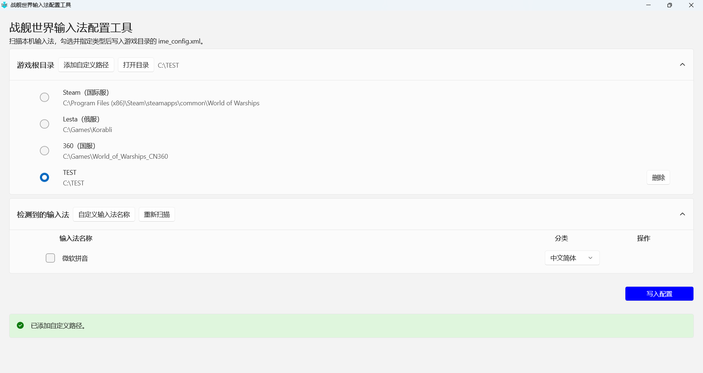

# <TitleIcon src="/icon/wows-ime.ico" /> WOWS-IME <FirstPartyBadge />

战舰世界中文输入法配置文件修改器

## 一、程序介绍

本程序针对游戏《战舰世界》的中文输入法的配置文件，目的为修订配置文件以支持更多的中文输入法。

## 二、如何下载

## 三、软件截图

## 四、开发者信息

<https://github.com/BlazeSnow>

## 五、版权信息

Copyright © 2026 BlazeSnow. 保留所有权利。

以GNU Affero General Public License v3.0的条款发布。

## 六、更新日志

更新日志见：<https://github.com/BlazeSnow/wows-ime/blob/main/CHANGELOG.md>
